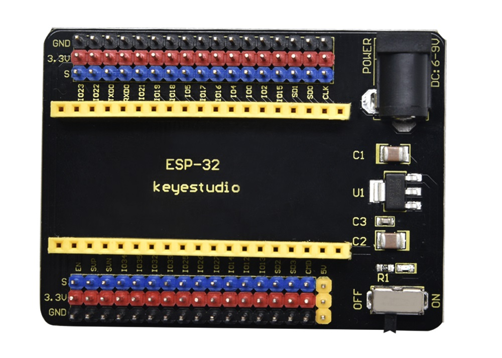
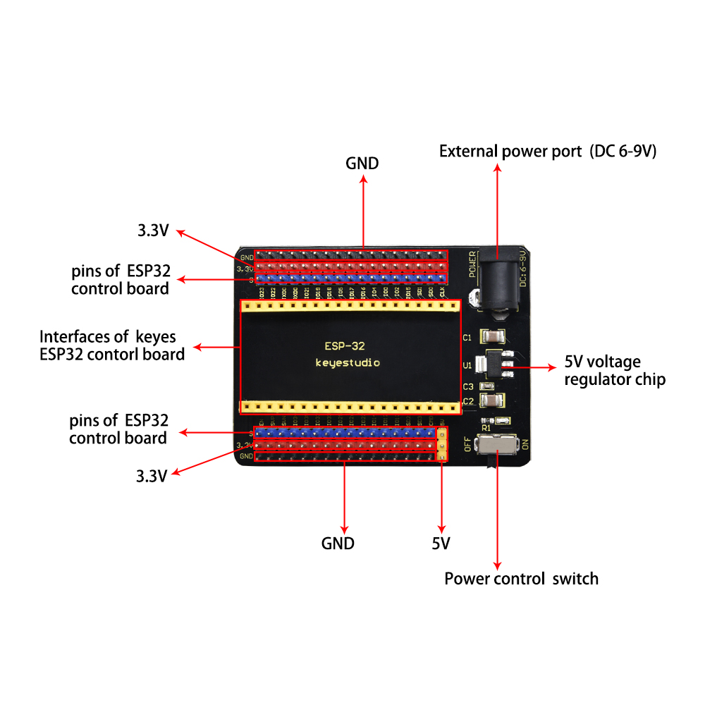
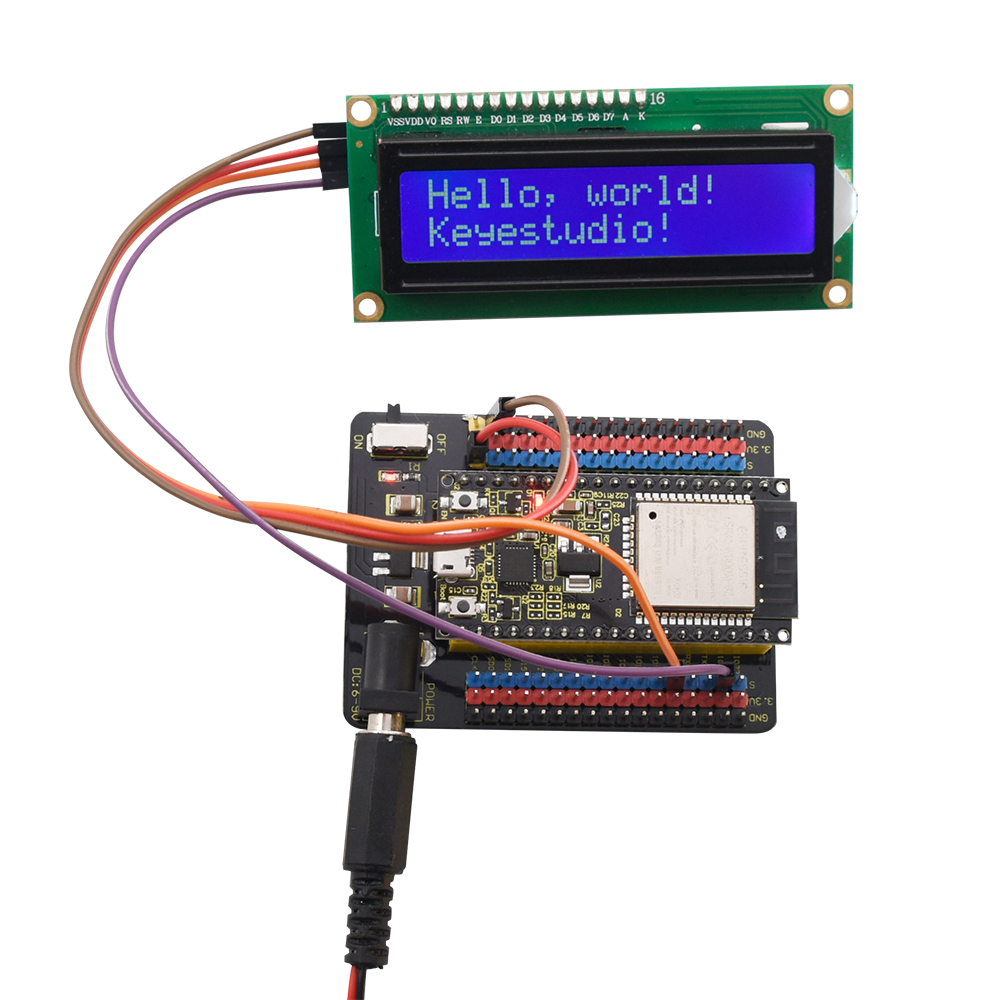

# **KS0465 keyestudio ESP32-IO Shield (Black and Eco-friendly)**

**(Black and Eco-friendly)**

# Introduction

The Keyestudio ESP32-IO shield is compatible with the [keyestudio ESP32 Core board](https://wiki.keyestudio.com/KS0413_keyestudio_ESP32_Core_Board). It expanses the pins of ESP32 core board with the 2.54mm pin headers. It also has two rows of pin headers for connecting sensors and modules. In addition, to supply power for ESP32 board, you only need to connect the DC 6-9V voltage to black DC head. Also, the DIP switch controls the on-off circuit.

# Performance Parameters

  - Supply voltage: DC 6-9V

  - Working current: 60mA

  - Maximum power: 0.3W

  - Operating temperature: -25℃ to +65℃

  - Dimensions: 30mm\*20mm

  - Environmental attributes: comply with ROHS standard
    
    **Pins Description**

**Example:**

