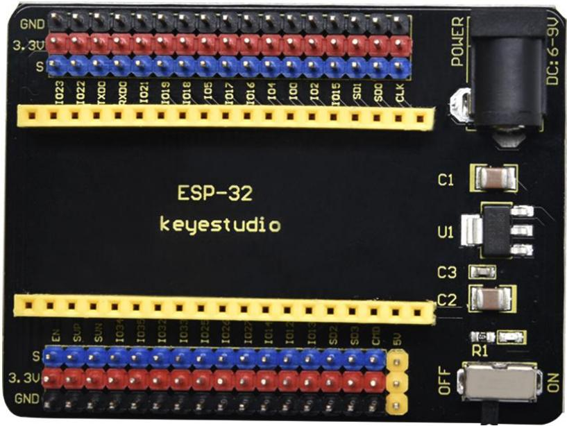
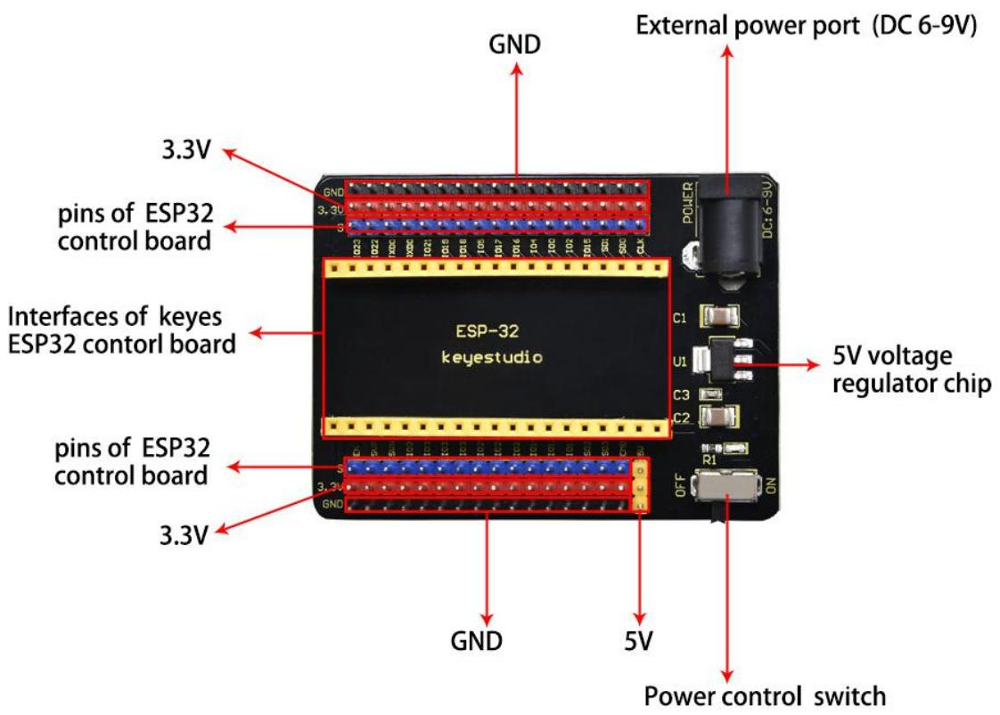
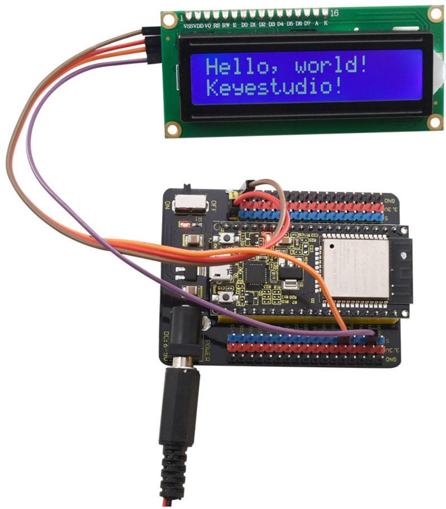

# keyestudio ESP32-IO Shield(Black and Eco-friendly)



## Introduction

The Keyestudio ESP32-IO shield is compatible with the [keyestudio ESP32 Core board](keyestudio ESP32 Core board). It expands the pins of ESP32 core board with the 2.54mm pin headers. It also has two rows of pin headers for connecting sensors and modules. In addition, to supply power for ESP32 board, you only need to connect the DC 6-9V voltage to black DC head. Also, the DIP switch controls the on-off circuit.

## Performance Parameters

- Supply voltage: DC 6-9V  
- Working current: 60mA 
- Maximum power: 0.3W  

- Operating temperature:  -25℃ to +65℃
- Dimensions:  30mm*20mm
- Environmental attributes: comply with ROHS standard

## Pins Description



## Example:

```c
#include <Wire.h>
#include <LiquidCrystal_I2C.h>

// Initialize the LCD with I2C address 0x27, 16 columns and 2 rows
LiquidCrystal_I2C lcd(0x27, 16, 2);

void setup() {
  lcd.init();             // Initialize the LCD
  lcd.backlight();        // Turn on the backlight
  lcd.clear();            // Clear the screen

  lcd.setCursor(0, 0);    // Set cursor to column 0, row 0 (first line)
  lcd.print("Hello, world!");  // Print on the first line

  lcd.setCursor(0, 1);    // Set cursor to column 0, row 1 (second line)
  lcd.print("Keyestudio!");    // Print on the second line
}

void loop() {
  // Nothing to do here
}

/*
Wiring for ESP32 to I2C LCD1602 module:
- LCD SDA pin -> ESP32 GPIO21 (SDA)
- LCD SCL pin -> ESP32 GPIO22 (SCL)
- LCD VCC pin -> 5V or 3.3V (check LCD module voltage requirements)
- LCD GND pin -> GND
*/

```

  
